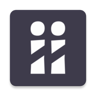
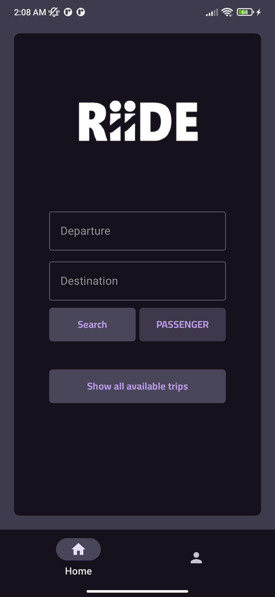
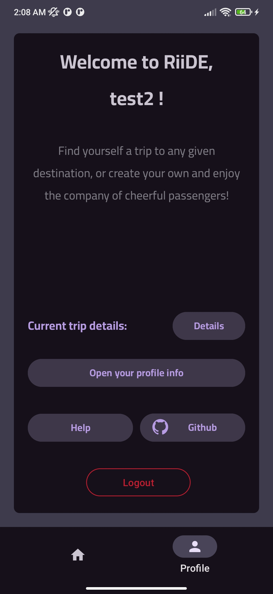
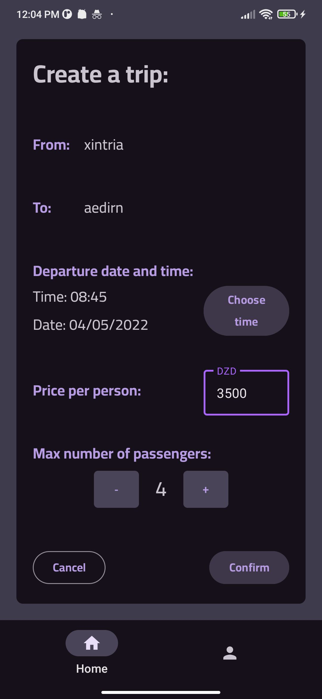

## 👨‍💻 Internship Details

- **Company:** CODTECH IT SOLUTIONS  
- **Name:** Ganesh  
- **Intern ID:** CT04DF511  
- **Domain:** Android Development  
- **Duration:** 4 Weeks  
- **Mentor:** Neela Santosh  

---

  

# RiiDE
RiiDE is a carpooling app that lets users search through, join or create trips to any given destination, and also helps managing the pricing, passengers, contact info and timings.

This app was roughly developed in a month from week-end to week-end as an end of cycle CS Bachelor's degree project, so it will not get any further updates after it's done.

# Screenshots

||||
|---|---|---|

# Features
- Auth
- Trip management
- Passanger management
- User profiles
- Search capabilities & indexing
- Rating system
- English & French localization

# Build
Simply cloning and building with android studio should do the trick, make sure to use the latest androidx libraries.

